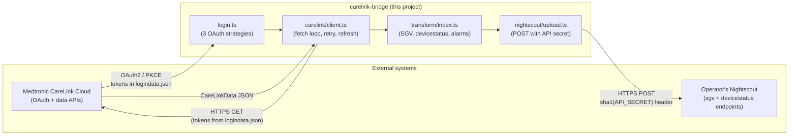
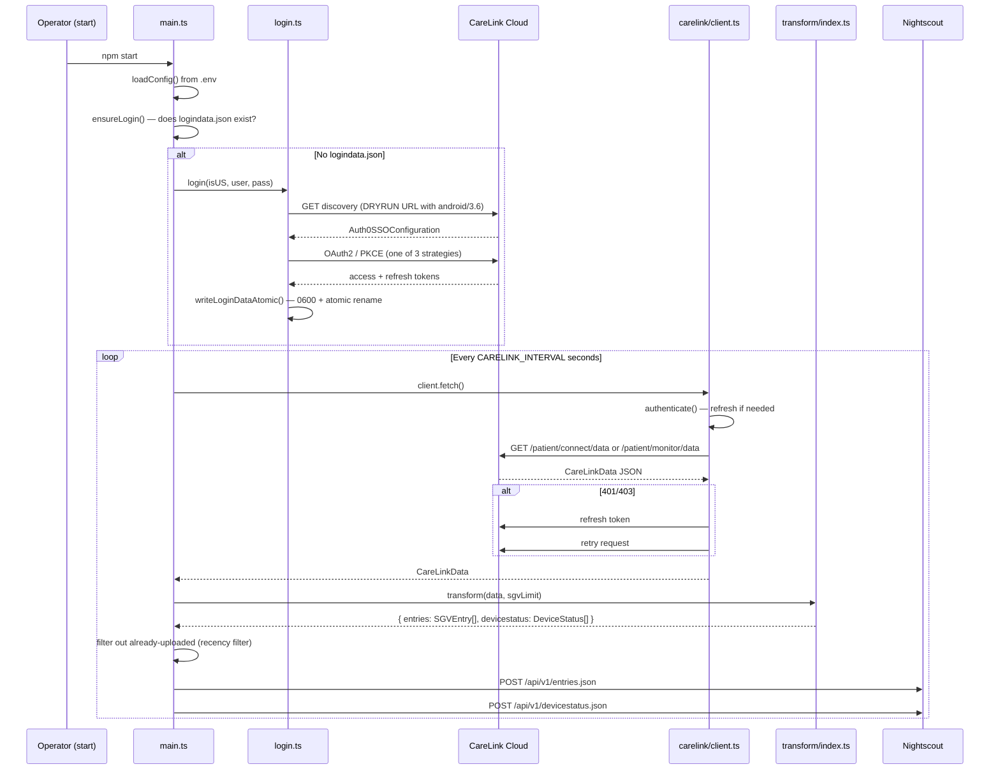
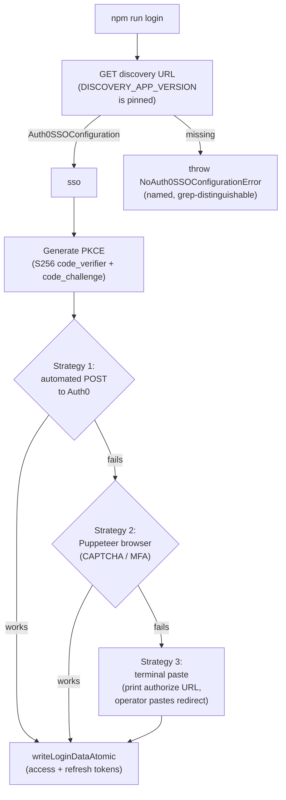

# Architecture

This document is for **contributors** — people reading or modifying
the bridge's code. If you want to install and run the bridge, see
[USER-GUIDE.md](../USER-GUIDE.md). If you want to ship a release,
see [CONTRIBUTING.md](../CONTRIBUTING.md).

## System overview



The bridge is a **fetch-and-upload daemon**. It owns no long-lived
state except a single file (`logindata.json`) holding the OAuth
tokens. There is no inbound network listener; the bridge only
initiates outbound HTTPS.

## Module map

```
src/
├── main.ts                  # Entry point: load config, ensure login, fetch loop
├── config.ts                # .env → typed Config
├── doctor.ts                # `npm run doctor` — pre-flight self-check
├── discovery.ts             # CareLink discovery app-version pin (ADR 0002)
├── login.ts                 # Three-strategy OAuth login flow
├── login-errors.ts          # Named error class for missing Auth0 config
├── filter.ts                # Recency filter — only upload new entries
├── last-alarm.ts            # CareLink alarm → Nightscout annotation
├── logger.ts                # Verbose-mode gating
├── refresh-failure.ts       # Classify Auth0 refresh failures (recoverable vs permanent)
├── retry-policy.ts          # Status-aware retry (ADR 0001)
│
├── carelink/                # The CareLink client + token storage
│   ├── client.ts            # CareLinkClient: fetch() loop, BLE/carepartner branch, forceRefresh
│   ├── token.ts             # LoginData persistence: atomic 0600 write (ADR 0003), JWT helpers
│   └── urls.ts              # EU/US server resolution + URL builders
│
├── nightscout/              # The Nightscout uploader
│   └── upload.ts            # POST entries/devicestatus, sha1(API_SECRET) header
│
├── transform/               # CareLinkData → NightscoutSGVEntry + NightscoutDeviceStatus
│   ├── index.ts             # Main transform: SGVs, devicestatus, mmol/L detection, trend mapping
│   ├── pump-offset.ts       # Quarter-hour pump-clock offset guess
│   └── trend-map.ts         # CareLink trend string → Nightscout trend number
│
└── types/                   # Type definitions only — no runtime code
    ├── carelink.ts          # CareLinkData, CareLinkUserInfo, Auth0SSOConfig, LoginData
    ├── nightscout.ts        # NightscoutSGVEntry, NightscoutDeviceStatus, TransformResult
    └── config.ts            # Config interface (the shape of the loaded .env)
```

### Where to start as a new contributor

1. `src/main.ts` — the **fetch loop**. 80 lines, three functions, the
   whole top-level flow. Read this first.
2. `src/carelink/client.ts` — the **CareLinkClient class**. The
   `fetch()` method is the entry point; `authenticate()` is the
   refresh logic; the private `fetchAsCarepartner` / `fetchAsPatient`
   / `fetchBleDeviceData` are the three data-fetch branches.
3. `src/transform/index.ts` — the **data model transformation**.
   `transform(data, sgvLimit)` is the only exported function; the
   rest are helpers.

## End-to-end data flow



### Recency filter

`src/filter.ts` exports `makeRecencyFilter(getKey)`, which returns
a function that takes an array of items and returns only items
whose key (date or timestamp) is newer than the highest key
previously seen. This is in-memory state — it does not persist
across restarts. On restart, the bridge re-uploads the last 24 SGVs
(`CARELINK_SGV_LIMIT=24` default), and Nightscout de-duplicates by
date+sgv. So a restart costs at most one duplicate upload, not
duplicate entries in Nightscout.

### The three CareLink fetch branches

`CareLinkClient.fetch()` dispatches based on the account type and
the device family:

1. **BLE device branch** (`fetchBleDeviceData`) — used when
   `deviceFamily` or `medicalDeviceFamily` indicates a BLE device
   (780G, Guardian 4, Simplera). Hits the carepartner data endpoint
   at a known list of API versions (`[13, 11, 6, 5]` in
   `src/carelink/client.ts`) and tries them newest-first. The
   version list is the historical set of Medtronic cumulus versions
   this code has been verified against.
2. **Patient monitor branch** (`fetchAsPatient`) — used for the
   patient's own account (not care-partner). Hits
   `/patient/monitor/data`.
3. **Patient connect branch** (`getConnectData`) — fallback for
   legacy accounts. Hits `/patient/connect/data?msgType=last24hours`.

The `deviceFamily || medicalDeviceFamily` fallback in `isBleDevice`
is the upstream fix from PR #2; the patient `monitor/data` endpoint
reports the family as `deviceFamily` (not `medicalDeviceFamily`),
and without the fallback 780G / Guardian 4 / Simplera devices
fall through to the legacy endpoint and get empty data. There is a
regression test pinning this in `test/ble-detection.test.ts`.

## The OAuth login flow

The login flow is the most complex single piece of the code. The
flow is in `src/login.ts`; the discovery pin is in
`src/discovery.ts`; the named error is in `src/login-errors.ts`.



### Why three strategies

Medtronic's Auth0 tenant supports multiple login paths and the
right one for a given account depends on whether the account has
CAPTCHA / MFA challenges, the operator's IP reputation, and the
Auth0 tenant's current risk model. The three strategies cover the
real failure modes:

- **Strategy 1 (automated):** Works for most accounts without
  CAPTCHA. Fast, no browser window.
- **Strategy 2 (browser):** Works when Auth0 challenges the
  request. Uses Puppeteer to open a real browser, the operator
  completes the challenge, the bridge intercepts the OAuth
  redirect. Requires Chrome / Edge / Chromium on the host.
- **Strategy 3 (terminal paste):** Works when neither of the
  above is possible. The bridge prints the Auth0 authorize URL,
  the operator opens it in any browser, logs in, copies the
  redirect URL containing the `code=...` parameter, pastes it
  back.

### The discovery version pin

The string `'android/3.6'` in `src/discovery.ts` is **load-bearing,
not cosmetic**. Medtronic's discovery endpoint returns a different
config per app version, and only some versions carry the
`Auth0SSOConfiguration` URL this flow needs:

- `android/3.4` — legacy OAuth (no Auth0).
- `android/3.6` / `3.7` — Auth0 (what this code uses).
- `android/4.0` — new cumulus, no Auth0.

Bumping the constant without verifying the new version returns
Auth0 config silently breaks login. The constant is documented in
[ADR 0002](./adr/0002-discovery-app-version-pin.md); the
verification date is in the file's own header comment.

## The data model

### From CareLink to Nightscout

```
CareLinkData (src/types/carelink.ts)
  │
  ├── sgs[]          ──transform──▶  NightscoutSGVEntry[]  ──POST──▶  /api/v1/entries.json
  ├── lastSG         ──transform──▶  (folded into entries)
  ├── lastSGTrend    ──transform──▶  trend number on entries[0]
  ├── medicalDeviceFamily, battery, reservoir, etc.
  │                  ──transform──▶  NightscoutDeviceStatus[]  ──POST──▶  /api/v1/devicestatus.json
  ├── lastAlarm      ──transform──▶  NightscoutLastAlarmAnnotation
  │                                    on the device status entry
  └── activeInsulin  ──transform──▶  pump.iob on the device status entry
```

The full mapping is in `src/transform/index.ts`. Notable details:

- **mmol/L detection.** `transform/index.ts` detects
  `bgunits`/`bgUnits` of `MMOL_L` (case-insensitive) and converts
  `sg` to mg/dL at the SGV assignment site
  (`Math.round(sg * 18.0182)`). Without this conversion, a mmol/L
  account flowing into Nightscout is interpreted as mg/dL by
  downstream looping clients (Loop, xDrip, AAPS) and over-delivers
  insulin. This is a load-bearing safety property; the conversion
  is unit-tested in `test/transform.test.ts`.
- **Trend mapping.** CareLink trend strings (`UP_DOUBLE`, `UP`,
  `FLAT`, `DOWN`, `DOWN_DOUBLE`, `NONE`, etc.) map to Nightscout
  trend numbers (1–7) in `src/transform/trend-map.ts`. The
  `NONE → {trend: 4, direction: 'Flat'}` case matches the
  convention used by xDrip and nightscout-connect.
- **Pump-clock offset.** `src/transform/pump-offset.ts` rounds
  the pump-clock / server-clock difference to the nearest 15
  minutes. Real-world UTC offsets are all multiples of 15 minutes
  (+05:30 India, +09:30 central Australia, +05:45 Nepal, -03:30
  Newfoundland); the quarter-hour rounding supports those zones
  while still absorbing up to ±7.5 minutes of pump clock drift.
  The previous whole-hour rounding skewed SGV timestamps by up to
  30 minutes for users in those zones. There is a regression
  test pinning the new behaviour in `test/pump-offset.test.ts`.
- **Last alarm.** `src/last-alarm.ts` converts the most recent
  CareLink alarm into a `NightscoutLastAlarmAnnotation` on the
  device status entry. Priority-1 paradigm codes (4, 5, 6, 16, 43,
  61) hit `console.warn` always-on, irrespective of verbose
  mode. There is no alarm relay to Nightscout's
  `/api/v1/treatments.json` (verified by an absence-grep test
  over `src/`).

### Stale-data threshold

`transform/index.ts` declares `STALE_DATA_THRESHOLD_MINUTES = 20`.
If the most recent SGV in the CareLink payload is older than that,
the data is not uploaded — Nightscout would otherwise show a flat
"last reading 45 minutes ago" trace that isn't useful for looping
decisions. The threshold is a constant, not a config var, because
changing it is a behaviour change that should go through code
review.

## Error and retry semantics

There are three independent error-handling modules:

| Module | Responsibility | Key export |
|--------|----------------|------------|
| `src/carelink/client.ts` `authenticate()` | Token refresh on 401/403; the `forceRefresh` flag survives successive 401s. | `(private) authenticate(forceRefresh): Promise<boolean>` |
| `src/retry-policy.ts` | Status-aware retry classification (fail-fast for permanent 4xx, `Retry-After` for 429, jittered backoff for 5xx and transport). | `decideRetry(error, options): RetryDecision` |
| `src/refresh-failure.ts` | Distinguishes permanent Auth0 refresh failures (HTTP 400 + `invalid_grant` / `invalid_client`) from recoverable ones (5xx, 429, transport, local-disk). | `isPermanentRefreshFailure(error): boolean` |

The 401/403 path is short-circuited before `decideRetry` so the
existing `forceRefresh` cycle still runs. The token file is
deleted only on a **permanent** refresh failure; recoverable
failures retain the file so the next fetch cycle can re-attempt
refresh. This avoids the failure mode where a transient CareLink
5xx (or a local disk full) deletes the token file and forces a
manual `npm run login`.

The retry policy itself is documented in
[ADR 0001](./adr/0001-status-aware-retry-policy.md).

## Token storage

`logindata.json` contains the OAuth tokens. With those tokens, any
local user on the host can act as the operator against CareLink.

The write path is `writeLoginDataAtomic()` in
`src/carelink/token.ts`. It:

1. Opens a temp file with `O_CREAT | O_EXCL | O_WRONLY` and
   `mode(0o600)`. The mode is set at `open()` time — no
   `chmod-after-create` window.
2. Writes the JSON, `fsync()`s, then `fs.rename()`s the temp file
   over the destination. `rename` is atomic on POSIX; the
   destination either holds the previous tokens or the new ones,
   never partial.
3. Refuses to write through a symlink. A symlinked
   `logindata.json` is a security risk; the rename would follow
   the symlink to wherever it points.

The read path (`loadLoginData`) calls
`tightenLoginDataIfLoose()` to bring pre-existing loose files
(mode `0o644` written by an older version) up to `0o600`. This is
idempotent and runs every load, so an upgrade from a pre-fix
version is closed without a one-shot migration step.

The full threat model and the alternatives considered are in
[ADR 0003](./adr/0003-atomic-token-write.md).

## Configuration

`src/config.ts` loads environment variables into a typed
`Config` object. The full set of env vars is documented in the
[user guide's settings table](../USER-GUIDE.md#settings).

Two non-obvious loaders in `src/config.ts`:

- `readEnv` falls back to `CUSTOMCONNSTR_<KEY>` and
  `CUSTOMCONNSTR_<key>` (lowercased). This is an Azure-style
  fallback that lets the bridge run on Azure App Service without
  the operator setting env vars directly. Documented in the
  source; if you're a new contributor wondering why a config
  var works in prod but not locally, this is why.
- `WEBSITE_HOSTNAME` is read as `nsHost` (a separate input from
  `NS`, which becomes `nsBaseUrl`). The Azure App Service
  convention is to inject the site hostname as
  `WEBSITE_HOSTNAME`; the bridge respects it.

## Test architecture

Tests live in `test/`, one file per source module. The test
runner is `vitest run` (CI runs on Node 20 and 22).

| Test file | What it covers |
|-----------|----------------|
| `atomic-write.test.ts` | Token file open flags, mode, symlink refusal, crash safety, read-path tightening |
| `ble-detection.test.ts` | `deviceFamily \|\| medicalDeviceFamily` fallback (regression for upstream PR #2) |
| `discovery.test.ts` | Discovery URL builder + app-version pin |
| `doctor.test.ts` | `npm run doctor` pre-flight self-check |
| `endpoint-candidates.test.ts` | Carepartner data endpoint version list |
| `filter.test.ts` | Recency filter (only-newest-kept) |
| `force-refresh.test.ts` | `authenticate()` return value + successive-401 regression |
| `integration.test.ts` | 429 + `Retry-After`, 404 fail-fast wiring |
| `last-alarm.test.ts` | Priority-1 codes, severity mapping, "never silent drop" |
| `login-errors.test.ts` | Named error + `selectAuth0ConfigUrl` helper |
| `pump-offset.test.ts` | Quarter-hour offset rounding (regression for whole-hour skew) |
| `refresh-failure.test.ts` | Permanent vs recoverable refresh failure classification |
| `retry-policy.test.ts` | Status-aware retry: fail-fast, `Retry-After`, jittered backoff |
| `transform.test.ts` | SGV + devicestatus transform, mmol/L conversion, trend mapping |
| `username-source.test.ts` | `accountUsername()` prefers server-reported username over `.env` |

### Fixture strategy

`test/fixtures.ts` and `test/samples.ts` are the only test
fixtures. The convention:

- `fixtures.ts` exports `data(overrides?)` — a function that
  returns a fully-populated `CareLinkData` object. Tests that
  want a "normal" payload call `data()` and then override the
  field under test. The base payload is the historical paradigm
  reference data (2015) carried in the upstream test suite.
- `samples.ts` exports specific named scenarios
  (`missingLastSgv`, `withTrend`) that test the production
  guards around edge cases. The `missingLastSgv` fixture has a
  trailing `sg: 0` entry that the production code must drop
  (real CGM sensors occasionally emit a zeroed reading on
  disconnect); the test pins the drop.

### What is NOT unit-tested

The CareLink HTTP calls themselves are not unit-tested. The
bridge's tests run against the local code, not against
`carelink.minimed.eu`. Real-data testing requires a CareLink
account with a connected pump (see
[CONTRIBUTING.md](../CONTRIBUTING.md#testing-with-real-carelink-data));
the project does not have a CI fixture for it, and the maintainer
does not have continuous access to a real pump to build one.

This means **a regression in the CareLink API shape is not
caught by the test suite**. The bridge's response is to add a
new `test/samples.ts` entry when a regression is reported, with
a sanitised real-payload fixture. The 780G payload items still
uncovered (markers for treatments, therapy algorithm state,
limits schedule, NGP-tier alarm codes) are tracked in
[ROADMAP.md](../ROADMAP.md).

## How to add a regression test

1. Find the source file the bug is in. If the test belongs to a
   new module, create a new `test/<name>.test.ts` following the
   one-file-per-module convention.
2. If you need a `CareLinkData` shape, build it with
   `data(overrides?)` from `test/fixtures.ts` or add a named
   scenario to `test/samples.ts`.
3. The test must defend an **observable contract**. "It doesn't
   throw" is not a contract; "it returns `false` for permanent
   refresh failures" is. Tests that pin a specific bug fix
   should reference the bug in the test name or in a comment.
4. The test must be deterministic. No real network, no real
   filesystem outside the temp dir, no real timers.
5. Run `npm test` and `npx tsc --noEmit` to verify.

## How to add a new feature

1. Open an issue first. The CONTRIBUTING.md policy is "no scope
   creep in PRs" — a feature is a separate PR from a bug fix
   is a separate PR from a refactor.
2. The PR description should answer:
   - What does this PR do? (one paragraph)
   - What is the observable contract? (what does the user see?)
   - How was it tested?
   - Does it diverge from upstream `domien-f/carelink-bridge`?
     (See [CONTRIBUTING.md](../CONTRIBUTING.md).)
3. If the feature is a new capability that requires a new
   runtime dependency, update [ADR 0005](./adr/0005-dependency-minimalism.md)
   in the same PR. The dependency count is the contract.
4. If the feature is a new architectural choice (e.g. a new
   failure-handling policy, a new login strategy), write a new
   ADR in `docs/adr/`. Cross-link from the relevant existing
   ADR if the new one supersedes it.

## Where to look next

- [USER-GUIDE.md](../USER-GUIDE.md) — install, configure, run,
  troubleshoot.
- [CONTRIBUTING.md](../CONTRIBUTING.md) — workflow, scope rules,
  release process.
- [SECURITY.md](../SECURITY.md) — threat model, how to report a
  vulnerability.
- [ROADMAP.md](../ROADMAP.md) — what's shipped, what's gated on
  what, what's out of scope.
- [CHANGELOG.md](../CHANGELOG.md) — version history with PR
  references.
- [deploy/README.md](../deploy/README.md) — Linux deployment
  runbook (systemd, Nightscout + cloudflared).
- [docs/adr/](./adr/) — architectural decision records.
