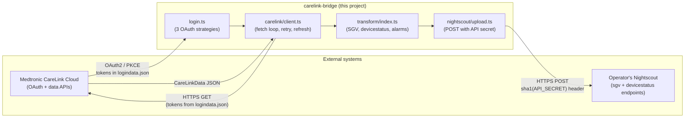
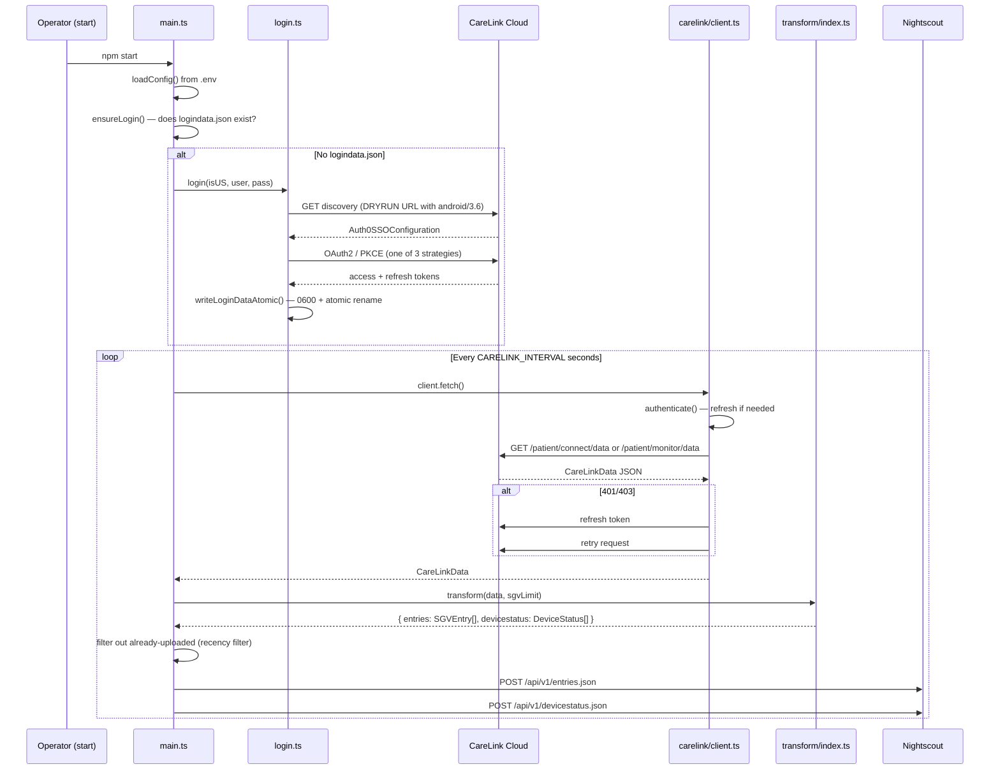
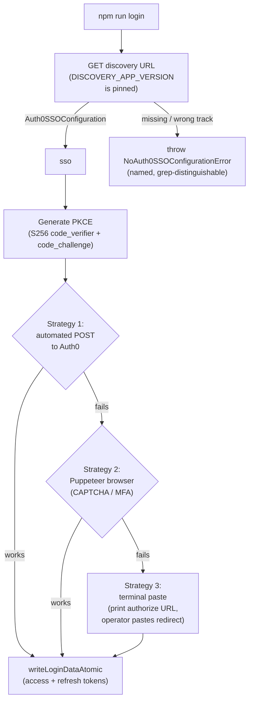

# Architecture

This document is for **contributors** — people reading or modifying
the bridge's code. If you want to install and run the bridge, see
[USER-GUIDE.md](../USER-GUIDE.md). If you want to ship a release,
see [CONTRIBUTING.md](../CONTRIBUTING.md).

## System overview


```mermaid
flowchart LR
  subgraph ext["External systems"]
    CL["Medtronic CareLink Cloud<br/>(OAuth + data APIs)"]
    NS["Operator's Nightscout<br/>(sgv + devicestatus endpoints)"]
  end
  subgraph bridge["carelink-bridge (this project)"]
    direction TB
    LOGIN["login.ts<br/>(3 OAuth strategies)"]
    FETCH["carelink/client.ts<br/>(fetch loop, retry, refresh)"]
    TRANSFORM["transform/index.ts<br/>(SGV, devicestatus, alarms)"]
    UPLOAD["nightscout/upload.ts<br/>(POST with API secret)"]
  end
  CL -- "OAuth2 / PKCE<br/>tokens in logindata.json" --> LOGIN
  LOGIN --> FETCH
  FETCH -- "HTTPS GET<br/>(tokens from logindata.json)" --> CL
  CL -- "CareLinkData JSON" --> FETCH
  FETCH --> TRANSFORM
  TRANSFORM --> UPLOAD
  UPLOAD -- "HTTPS POST<br/>sha1(API_SECRET) header" --> NS
```

The bridge is a **fetch-and-upload daemon**. It owns no long-lived
state except a single file (`logindata.json`) holding the OAuth
tokens. By default there is no inbound network listener; the bridge only
initiates outbound HTTPS. Setting CARELINK_METRICS_PORT opts into a
loopback-only observability server (/healthz + /metrics, src/observe-server.ts).

## Module map

```
src/
├── main.ts                  # Entry point: load config, ensure login, fetch loop (wires logger + metrics)
├── config.ts                # .env → typed Config (includes LOG_FORMAT)
├── doctor.ts                # `npm run doctor` — pre-flight self-check
├── discovery.ts             # CareLink discovery app-version pin (ADR 0002)
├── login.ts                 # Three-strategy OAuth login flow
├── login-errors.ts          # Named error class for missing Auth0 config
├── filter.ts                # Recency filter — only upload new entries
├── last-alarm.ts            # CareLink alarm → Nightscout annotation
├── logger.ts                # Structured logger: pretty (default) or json (LOG_FORMAT=json); redacts credential-looking field KEYS
├── metrics.ts               # Prometheus counters/gauges + renderPrometheus() (incl. carelink_circuit_open)
├── observe-server.ts        # Opt-in loopback /healthz + /metrics server (node:http, CARELINK_METRICS_PORT)
├── refresh-failure.ts       # Classify Auth0 refresh failures (recoverable vs permanent)
├── retry-policy.ts          # Status-aware retry (ADR 0001)
│
├── carelink/                # The CareLink client + token storage
│   ├── client.ts            # CareLinkClient: fetch() loop, BLE/carepartner branch, forceRefresh
│   ├── token.ts             # LoginData persistence: atomic 0600 write (ADR 0003), JWT helpers
│   └── urls.ts              # EU/US server resolution + URL builders
│
├── nightscout/              # The Nightscout uploader
│   └── upload.ts            # POST entries/devicestatus, sha1(API_SECRET) header
│
├── transform/               # CareLinkData → NightscoutSGVEntry + NightscoutDeviceStatus
│   ├── index.ts             # Main transform: SGVs, devicestatus, mmol/L detection, trend mapping
│   ├── pump-offset.ts       # Quarter-hour pump-clock offset guess
│   └── trend-map.ts         # CareLink trend string → Nightscout trend number
│
└── types/                   # Type definitions only — no runtime code
    ├── carelink.ts          # CareLinkData, CareLinkUserInfo, Auth0SSOConfig, LoginData
    ├── nightscout.ts        # NightscoutSGVEntry, NightscoutDeviceStatus, TransformResult
    └── config.ts            # Config interface (the shape of the loaded .env)
```

### Where to start as a new contributor

1. `src/main.ts` — the **fetch loop**. 80 lines, three functions, the
   whole top-level flow. Read this first.
2. `src/carelink/client.ts` — the **CareLinkClient class**. The
   `fetch()` method is the entry point; `authenticate()` is the
   refresh logic; the private `fetchAsCarepartner` / `fetchAsPatient`
   / `fetchBleDeviceData` are the three data-fetch branches.
3. `src/transform/index.ts` — the **data model transformation**.
   `transform(data, sgvLimit)` is the only exported function; the
   rest are helpers.

## End-to-end data flow


```mermaid
sequenceDiagram
  participant Op as Operator (start)
  participant Main as main.ts
  participant Login as login.ts
  participant CL as CareLink Cloud
  participant Client as carelink/client.ts
  participant Trans as transform/index.ts
  participant NS as Nightscout

  Op->>Main: npm start
  Main->>Main: loadConfig() from .env
  Main->>Main: ensureLogin() — does logindata.json exist?
  alt No logindata.json
    Main->>Login: login(isUS, user, pass)
    Login->>CL: GET discovery (DRYRUN URL with android/3.6)
    CL-->>Login: Auth0SSOConfiguration
    Login->>CL: OAuth2 / PKCE (one of 3 strategies)
    CL-->>Login: access + refresh tokens
    Login->>Login: writeLoginDataAtomic() — 0600 + atomic rename
  end

  loop Every CARELINK_INTERVAL seconds
    Main->>Client: client.fetch()
    Client->>Client: authenticate() — refresh if needed
    Client->>CL: GET /patient/connect/data or /patient/monitor/data
    CL-->>Client: CareLinkData JSON
    alt 401/403
      Client->>CL: refresh token
      Client->>CL: retry request
    end
    Client-->>Main: CareLinkData
    Main->>Trans: transform(data, sgvLimit)
    Trans-->>Main: { entries: SGVEntry[], devicestatus: DeviceStatus[] }
    Main->>Main: filter out already-uploaded (recency filter)
    Main->>NS: POST /api/v1/entries.json
    Main->>NS: POST /api/v1/devicestatus.json
  end
```

### Recency filter

`src/filter.ts` exports `makeRecencyFilter(getKey)`, which returns
a function that takes an array of items and returns only items
whose key (date or timestamp) is newer than the highest key
previously seen. This is in-memory state — it does not persist
across restarts. On restart, the bridge re-uploads the last 24 SGVs
(`CARELINK_SGV_LIMIT=24` default), and Nightscout de-duplicates by
date+sgv. So a restart costs at most one duplicate upload, not
duplicate entries in Nightscout.

### The CareLink fetch branches

`CareLinkClient.fetch()` dispatches based on the account type and
the device family:

1. **BLE device branch** (`fetchBleDeviceData`) — used when
   `deviceFamily`/`medicalDeviceFamily` **or**
   `deviceModel`/`sensorModel` indicates a BLE device
   (780G, Guardian 4, Simplera). POSTs the single
   `blePereodicDataEndpoint` URL from country settings — one endpoint,
   no version fallback.
2. **Carepartner standard branch** (`fetchAsCarepartner`, when the
   monitor check finds no BLE device) — hits the carepartner data
   endpoint at a known list of API versions (`[13, 11, 6, 5]` in
   `src/carelink/client.ts`, via `buildEndpointCandidates()`) and
   tries them newest-first. The version list is the historical set
   of Medtronic cumulus versions this code has been verified
   against.
3. **Patient monitor branch** (`fetchAsPatient`) — used for the
   patient's own account (not care-partner). Hits
   `/patient/monitor/data`.
4. **Patient connect branch** (`fetchConnectData`, reached from
   `fetchAsPatient` when `monitor/data` yields nothing) — fallback for
   legacy accounts. Hits `/patient/connect/data?msgType=last24hours`,
   trying the configured data host then its clcloud sibling, taking the
   first 200 with a non-empty body (#74). An unrecognised
   `MMCONNECT_SERVERNAME` yields a single candidate and keeps the
   pre-#74 behaviour. The precedence rule, stated exactly:

   - an empty body never ends the loop, and a throw from one candidate does
     not abort it;
   - if every candidate errored, the error re-thrown is the **configured
     host's**, so an empty body from the sibling cannot mask a recorded
     failure from the configured host (that would record a circuit-breaker
     success and skip `forceRefresh` on a 401 while CareLink was erroring);
   - if nothing errored, the configured host's empty body is returned as
     data — a genuinely empty payload, not a transport failure.

   Both directions preserve what a single-candidate bridge used to do; see
   `test/data-host-fallback.test.ts`.

The `deviceFamily || medicalDeviceFamily` fallback is the upstream fix
from PR #2. Since #73 it lives in `deviceIdentity()`
(`pick('deviceFamily') ?? pick('medicalDeviceFamily')`), not in
`isBleDevice()` — the patient `monitor/data` endpoint reports the family
as `deviceFamily` (not `medicalDeviceFamily`),
and without the fallback 780G / Guardian 4 / Simplera devices
fall through to the legacy endpoint and get empty data.

Since #73 the matcher is **case-insensitive and normalised** (uppercased,
non-alphanumerics stripped) and also accepts `deviceModel`/`sensorModel`.
Both changes were needed: Medtronic's portal defines its family value as
`SIMPLERA_SYSTEM = "Simplera™ system"` — mixed case, which a plain
`includes('SIMPLERA')` misses — and the API returns `deviceModel` and
`sensorModel` (sentinel `"NO_SENSOR"`) alongside the family strings, which
this bridge previously ignored entirely. Which exact spelling the wire uses
is UNVERIFIED (needs a real token), which is why the matcher is deliberately
lenient rather than matching one form. See #73.

## The OAuth login flow

The login flow is the most complex single piece of the code. The
flow is in `src/login.ts`; the discovery pin is in
`src/discovery.ts`; the named error is in `src/login-errors.ts`.


```mermaid
flowchart TB
  start["npm run login"]
  start --> disc["GET discovery URL<br/>(DISCOVERY_APP_VERSION<br/>is pinned)"]
  disc -->|Auth0SSOConfiguration| sso
  disc -->|missing / wrong track| err["throw NoAuth0SSOConfigurationError<br/>(named, grep-distinguishable)"]
  sso --> pkce["Generate PKCE<br/>(S256 code_verifier + code_challenge)"]
  pkce --> s1{"Strategy 1:<br/>automated POST<br/>to Auth0"}
  s1 -->|works| done["writeLoginDataAtomic<br/>(access + refresh tokens)"]
  s1 -->|fails| s2{"Strategy 2:<br/>Puppeteer browser<br/>(CAPTCHA / MFA)"}
  s2 -->|works| done
  s2 -->|fails| s3["Strategy 3:<br/>terminal paste<br/>(print authorize URL,<br/>operator pastes redirect)"]
  s3 --> done
```

`selectAuth0ConfigUrl()` in `src/login-errors.ts` throws
`NoAuth0SSOConfigurationError` on **three** conditions, not only the
missing-config case the diagram labels:

- the entry resolves no Auth0 config URL at all;
- `baseUrlCumulus` resolves to a URL that does **not** end in
  `/connect/carepartner/v13` — issue #75, and `android/3.5` is exactly
  this case: login looks healthy, then the data call fails with no
  named error;
- `baseUrlCumulus` is absent or is not a string, which **fails closed**
  rather than being assumed to be v13.

The cumulus-track gate runs first, because it is the structural
invariant and it can say something the URL-resolution check cannot. The
message names the observed value and the verified fallback family
(`VERIFIED_AUTH0_V13_FAMILY`), so the failure is grep-distinguishable in
journald and points at the constant to inspect.

### Why three strategies

Medtronic's Auth0 tenant supports multiple login paths and the
right one for a given account depends on whether the account has
CAPTCHA / MFA challenges, the operator's IP reputation, and the
Auth0 tenant's current risk model. The three strategies cover the
real failure modes:

- **Strategy 1 (automated):** Works for most accounts without
  CAPTCHA. Fast, no browser window.
- **Strategy 2 (browser):** Works when Auth0 challenges the
  request. Uses Puppeteer to open a real browser, the operator
  completes the challenge, the bridge intercepts the OAuth
  redirect. Requires Chrome / Edge / Chromium on the host.
- **Strategy 3 (terminal paste):** Works when neither of the
  above is possible. The bridge prints the Auth0 authorize URL,
  the operator opens it in any browser, logs in, copies the
  redirect URL containing the `code=...` parameter, pastes it
  back.

### The discovery version pin

The string `'android/3.6'` in `src/discovery.ts` is **load-bearing,
not cosmetic**. Medtronic's discovery endpoint returns a different
config per app version, and only some versions carry the
`Auth0SSOConfiguration` URL this flow needs:

- `android/3.5` — **selects** the Auth0 config but sits on cumulus
  **v11**, so it is *not* a usable fallback (see ADR 0002).
- `android/3.6` / `3.7` / `3.8` — Auth0 **and** cumulus v13. The only
  cells that are both; this code uses `3.6`.
- `android/3.9` / `4.x` / `5.0` / `6.0` / `10.0` — cumulus v2, no
  Auth0. A "newer-looking number" is not a better number.

The full 23-cell matrix, the two orthogonal axes of the discovery URL,
and the guard that must check the cumulus track rather than the mere
presence of the config key are in
[ADR 0002](./adr/0002-discovery-app-version-pin.md). The verification
date is in the constant's own header comment.

### Discovery-document tripwires (issue #77)

`src/discovery.ts` also exports a change tripwire over the discovery
document's `certificates[]` signer pin list:
`checkDiscoveryCertificates()`, which returns a
`DiscoveryCertificatesReport`; `fingerprintCertificates()`, the sha256
helper; and the two recorded values, `VERIFIED_DISCOVERY_CERT_COUNT` and
`PINNED_DISCOVERY_CERT_FINGERPRINT`. **VERIFIED live 2026-10-09:** the
live list is 8 `{host, cert}` entries, and all 8 carry **one**
certificate pinned for 8 hostnames (carelink.minimed.com,
carelink.minimed.eu, clcloud.minimed.com, clcloud.minimed.eu,
carelink-trials.minimed.com, clcloud-trials.minimed.com,
www.medtronic.com, carelink-content.medtronic.com), so a change detector
has to watch the host set as well as the certificate bytes.

The policy is **warn, never throw**. Medtronic rotating its signer list
is legitimate, so every divergence — absent, unparseable, wrong count,
changed bytes — is reported through `report.warning` for the caller to
log, and none of them aborts the login.

Two things it is **not**:

- **It is not wired into `src/login.ts` yet.** Zero runtime change today:
  the helper is exported and unit-tested, and the call site is
  deliberately left alone to keep the auth path's diff minimal. TLS is
  still what authenticates the transport.
- **It is not a tenant discriminator.** The `certificates[]` block is
  byte-identical across the patient and trials documents (**VERIFIED**:
  identical document sha256 across `clcloud.minimed.{eu,com}` and
  `clcloud-trials.minimed.com`), and unchanged on off-track app
  versions — so it says nothing about which tenant or cumulus track you
  are on. It is also not, and cannot be, verification of the
  undocumented `x-cum-signature` header; that algorithm is unknown.

The fingerprint's canonical form is sha256 over the `[host, cert]` pairs
sorted by host then cert, JSON-serialised — order-insensitive on purpose,
so a reordered array is not a false alarm.
`test/discovery.test.ts` pins `PINNED_DISCOVERY_CERT_FINGERPRINT` to the
value recorded from the live document, so the constant cannot drift
silently.

## Live CareLink API surface

> [!IMPORTANT]
> **The full published map lives at
> [`NovaLux12/carelink-api-research`](https://github.com/NovaLux12/carelink-api-research)**
> — start with its
> [`docs/00-summary-the-map.md`](https://github.com/NovaLux12/carelink-api-research/blob/main/docs/00-summary-the-map.md).
> This section keeps **only what this bridge depends on**, plus the
> corrections that were paid for here. It is not the estate map.

What the research repo has **added or moved** since this section was written —
read it before relying on anything below:

- **`/patient/v2/configuration/public` is unauthenticated** and carries 69 keys, including the complete device-family vocabulary. Nothing below knows about it.
- **`/patient/v2/monitor/data` is live, 405 POST-only**, and `/patient/v2/users/me` is 401 — the v2 tree is a real data plane, not just config.
- **`/patient/reports/*` is live on `carelink.minimed.eu`**, so the reports surface behind issue #76 is not `commoncore`-only. `commoncore.medtronic.*` now returns a CloudFront **502 "could not resolve the origin domain name"** — an origin DNS failure, not an absence.
- **There is a patient-facing client** on `carelink.minimed.eu` / `carelink-support.minimed.eu` with 70 `/patient/*` endpoints not in the clinician bundle, and the clinician bundle now replicates across **five** hosts.
- **`/patient/countries` (117 countries) and `/patient/languages`** answer unauthenticated.
- **The 16-family vocabulary is published**, and the vendor's own patient app matches on five tokens (`BLE`, `BLE_X`, `SIMPLERA`, `SIMPLERA_X`, `GUARDIAN`) via `startsWith` — `CC880` is not among them. See [`docs/05-devices-and-vocabulary.md`](https://github.com/NovaLux12/carelink-api-research/blob/main/docs/05-devices-and-vocabulary.md).


Everything in this section was **verified live on 2026-10-08** against
`clcloud.minimed.{eu,com}` and `carelink.minimed.{eu,com}` with a
read-only, unauthenticated, low-rate probe (~1.2s between requests, no
credentials, nothing written to Medtronic). Without a token the only
status-free signal available is the response code, so **401 / 403 means
"this path exists and is reachable"** and 404 means it does not — with the
one sharp exception spelled out under the `pde/v3` row below: on
`clcloud.*` a **403 with `{"message":"Missing Authentication Token"}` is a
gateway-level rejection**, not an app-level auth check.
Anything that could not be probed without credentials is labelled
**inferred** or **unverified**; anything sourced from a third-party
client's source code is labelled as such and is never stated as
Medtronic fact.

### Host families — which ones are the patient API

| Host | What it is | Patient API? |
|------|------------|--------------|
| `carelink.minimed.{eu,com}` | The **metadata** host — `/patient/*` identity + config. | **Yes — what this bridge uses** |
| `clcloud.minimed.{eu,com}` | The **cumulus** host — `/connect/carepartner/*` data and discovery. Serves the `/patient/*` paths too, but 403s nearly all of them. | **Yes (data leg)** |
| `carelink-trials.minimed.com` | The **trials** tenant. All three regions point here from the `v11` discovery base path — see [ADR 0002](./adr/0002-discovery-app-version-pin.md). | **No — different tenant** |
| `commoncore.medtronic.{eu,com}` | The **reports** API (`reports-broker/v1/ocl`, `reports-metadata/v1/ocl`). Token-gated. | **No** — clinician/report surface |
| `carelinkhp.minimed.eu` | The clinician / HCP portal: an Angular SPA that returns HTML for every path. | **No — not an API** |
| `carelink-content.medtronic.com` | `baseUrlCms` in the discovery document. An S3 bucket (403 AccessDenied on list). | **No** |
| `commoncore.minimed.{eu,com}` | A **different** host from `commoncore.medtronic.*`. Currently 502 on every path. | **No** |
| `clcloudsnp.minimed.{eu,com}` | Static-resource server. | **No** |
| `carelink-support.minimed.{eu,com}` | Support pages — 404 on the discovery path. | **No** |
| `carelink-subject.minimed.com` | A 301 redirect to `carelink-trials.minimed.com` (marketing alias). | **No** |

Several `carelink-*` / `clcloud-*` names resolve to Medtronic-internal
IP addresses and hang on the TLS handshake — those are the CloudFront
origins, not publicly reachable. Additional internal-only hostnames are
resolvable via public certificate-transparency logs; they are
**out of scope** for this bridge and are deliberately not enumerated
here.

**The `medtronic.eu` domain gotcha.** The reports API and a **second
Auth0 tenant** live on `medtronic.eu`, **not** `minimed.eu`:
`carelink.`, `carelink-login.`, `carelink-support.`, `clcloud.` and
`commoncore.` all have live siblings on that domain. Host sweeps
limited to `*.minimed.*` never see them — which is exactly how
`commoncore.medtronic.eu` stayed invisible. The second Auth0 tenant
(`carelink-login.medtronic.eu`, issuer `https://carelink-login.medtronic.eu/`)
advertises an otherwise identical OAuth policy but with a **different
JWKS `kid` set** from the `minimed.*` tenants. It is **not** referenced
by the minimed discovery document, so the bridge has no reason to touch
it; it is recorded here so a future host sweep does not mistake it for a
duplicate of the `minimed.*` tenant.

### Metadata vs data: which host serves what

| Path | `carelink.minimed.{eu,com}` | `clcloud.minimed.{eu,com}` |
|------|-----------------------------|----------------------------|
| `/patient/users/me` | **401** `InvalidToken` | 403 |
| `/patient/users/me/profile` | **401** | 403 |
| `/patient/monitor/data` | **401** | 403 |
| `/patient/m2m/links/patients` | **401** | 403 |
| `/patient/dataUpload/recentUploads` | **405** (POST-only) | 403 |
| `/patient/connect/data` | **401** | **401** |
| `/patient/m2m/connect/data/gc/patients/{username}` | **401** | **401** |
| `/patient/countries/settings?…` | **200** (public) | 403 |
| `/patient/configuration/system/…` | **200** (public) | 403 |
| `/api/carepartner/v2/{users/me,links/patients}` | **401** | — |
| `/connect/carepartner/{v6,v11,v13}/display/message` | — | **401** `Authentication failure` |
| `/connect/pde/v3/*` | — | **403** `Missing Authentication Token` |

**Reading:** the *metadata* endpoints live only on `carelink.*`; the
two *data* endpoints (`connect/data`, `m2m/…/gc/patients/*`) are served
by **both** hosts. So the bridge's choice of `carelink.minimed.eu` for
everything is valid — nothing it calls is host-wrong.

**PDE row, and why it names one version:** only `/connect/pde/v3/*` was
requested live; it answered **403**
`{"message":"Missing Authentication Token"}`. The wider `v{1..4}` range in
an earlier revision of this table came from the `baseUrlPde` values
*declared* inside saved discovery documents, not from requests ever made
to `v1`, `v2` or `v4`, so nothing is claimed about those paths.

**The 403 is a gateway-level rejection. Do not read it as "exists and
needs a token."** Re-probed twice on 2026-10-09 (**VERIFIED**), the same
answer both times: on `clcloud.*` a 403 carrying
`{"message":"Missing Authentication Token"}` means the host **does not
route the path to a CareLink-app auth check at all**. That is a different
thing from the bridge's own endpoints, which answer the app-level
**401 `{"error":{"type":"InvalidToken","group":"AUTH"}}`** on
`carelink.*` when a path exists but the token is missing or invalid.
`/patient/users/me` on `clcloud.*` behaves identically to `pde/v3` — 403
with the same body — and so does `/patient/monitor/data` and
`/patient/m2m/links/patients`, which is why the table marks them 403
rather than 401. So for this row the honest statement is "reachable, but
not by this host", not "exists and is token-gated".

This row was corrected **twice in the wrong direction** and is recorded
that way on purpose: the original 2026-10-08 probe returned 403, the
research note then recorded 401, and a later review round "corrected" the
doc from 403 (right) to 401 (wrong) by trusting the note. It is marked
VERIFIED because it was re-probed, not because four rounds agreed on it.

**Inferred, not verified:** the claim that `clcloud.*/patient/connect/data`
is a drop-in alternative to the `carelink.*` host for an EU account. xDrip+
moved both data endpoints to `clcloud.minimed.eu` unconditionally
(third-party source, PR #3859) on the report that the old cloud data
endpoint no longer works outside the US. Both hosts answer 401
unauthenticated, so nobody with EU credentials has confirmed it. On this
branch the legacy `connect/data` fetch tries **both** hosts — configured
host first, sibling second, via `dataHostCandidates()` in
`src/carelink/urls.ts` (the URL-builder pair `connectDataCandidates()`
maps that host list to full URLs) — taking the first 200 with a non-empty
body; an empty body never ends the loop. A throw from one candidate does
not abort it either, and when every candidate has failed the error that
is re-thrown is the configured host's — so an empty body from the sibling
host must not mask a recorded failure from the configured host. Which
host actually carries EU data is still a **November validation item**,
not a finding.

A host is only a valid *sibling* candidate when it is recognisably
`carelink.*` or `clcloud.*` on `minimed.eu`/`minimed.com`; an operator
pointing `MMCONNECT_SERVERNAME` at their own reverse proxy yields no
sibling and keeps the single-host behaviour.

### The three live namespaces

Three conventions are simultaneously live and they differ only in the
**identity** leg:

1. **This bridge (and xDrip's legacy path)** — `carelink.minimed.{eu,com}/patient/*`
   for metadata, `clcloud.minimed.{eu,com}/connect/carepartner/v{N}/display/message`
   for data.
2. **xDrip's current `cloudServer()`** — `clcloud.minimed.{eu,com}/patient/*`
   (third-party client choice, not a Medtronic recommendation).
3. **The official CareLink app** — `carelink.minimed.{eu,com}/api/carepartner/v2/*`
   for identity, which is what the discovery document declares as
   `baseUrlCareLink`, plus the same cumulus `display/message` data leg.

The hybrid `/api/carepartner/v2/patient/*` 404s. **Unverified:** which
namespace actually returns data with a valid token — both answer 401
unauthenticated, and the question cannot be settled without credentials
(see [ROADMAP.md](../ROADMAP.md) for the cheap authenticated checks).

### Region naming: three names, two tenants

The non-US tenant is spelled differently by every source that mentions
it:

| Source | Value |
|--------|-------|
| discovery `CP[].region` | `US` / **`EU`** / `CLINICAL` |
| country-settings `region` | **`OUS`** (GB also reports `bgUnits: MMOL_L`) |
| SSO config `client.audience` | `carepartner.patient.us` / **`carepartner.patient.ous`** / `carepartner.patient.cl` |

`EU` and `OUS` are the same tenant under two names. `MMCONNECT_SERVER=EU`
and `resolveServerName()` in `src/carelink/urls.ts` match the discovery
naming, which is consistent — but anyone reading a country-settings or
SSO response will see `OUS` and may not connect the two.

**Do not read that `bgUnits` parenthetical as a units claim.**
Country-settings `bgUnits` is a **per-country display preference**, not
the account's unit (**VERIFIED live 2026-10-09**): AU, GB, IE, NL and NZ
report `MMOL_L` and the US reports `MG_DL`, but **DE and FR report
`MG_DL`** despite being mmol/L countries — re-probed with `language=de`,
so it is not a language artifact. The account's real unit comes from the
**data payload**, which is why `src/transform/index.ts` reads
`data.bgunits ?? data.bgUnits` and never consults country settings. The
v0.2.0 mmol/L conversion therefore keys off what CareLink actually sends,
not off which country the operator is in.

### Unauthenticated endpoints

Two `/patient/*` paths answer **200 without any authentication** on
`carelink.*` (issue #79):

- **`/patient/countries/settings?countryCode=XX&language=YY`** — the
  bridge already relies on this: it is where `blePereodicDataEndpoint`
  (the BLE data path) comes from. Verified 200 unauthenticated.
- **`/patient/configuration/system/personal.cp.m2m.enabled`** — returns
  `{"value":"true"}`. Nearby siblings
  (`personal.cp.m2m.mobileEnabled`, `personal.device.ble.enabled`,
  `personal.cp.uploaderAllowed`, `personal.cgm.ioxEnabled`) all 404, so
  it is one specific exposed key, not a wildcard. Host-specific:
  `clcloud.*` 403s the same path.

**The bridge must not treat a 401 on either of these as fatal — it does
not call `/patient/configuration/system/*` at all**, and there is no
bridge need for it. The value is a feature flag, not patient data. The
only reason it matters is that the namespace does not enforce auth, so
a future key with a sensitive value would be exposed the same way; it
is worth re-probing, not wiring into the fetch loop.

### Device identification

A CareLink data response identifies the device three ways:
`medicalDeviceFamily` (older endpoints), `deviceFamily` (`monitor/data`),
and the model numbers `deviceModel` / `sensorModel` — the last with the
sentinel `"NO_SENSOR"` meaning "no sensor attached". The **Nightscout
side of the bridge never sees the model fields**: `src/transform/index.ts`
reads only the `*Family` strings. The model fields are used for one thing
only — deciding whether the account needs the BLE data endpoint — and
`CareLinkData` does not even declare them (they arrive through its index
signature and are narrowed in one place, `deviceIdentity()` in
`src/carelink/client.ts`).

The model numbers below come from **Medtronic's own portal bundle** (a
public asset, no auth) and are recorded so nobody has to re-derive them:

| Model codes | Device |
|-------------|--------|
| `MMT-1880/1881/1882` | 770G |
| `MMT-1884, MMT-1884XCU, MMT-1885, MMT-1885XCE, MMT-1886, MMT-1886XCE, MMT-1886XCF` | **780G** (the pump this repo is waiting on) |
| `MMT-7841` | Guardian 4 Sensor |
| `MMT-5120` | Simplera Sync |
| `MMT-5420` + SKUs 78893/78953/78955/78957/78959/78960-01 | Instinct Sensor |
| SKUs 78954/78956/78958-01 | Instinct Go |
| `MMT-8200`/`8201`, `MMT-6500`/`6501`, `MMT-8400`/`8401`, `gm4_snapshot` | Guardian 4 / Simplera **systems** + the guardian-4 sentinel — **INFERRED** from Medtronic's portal bundle, **not** a wire observation |
| `CSS-7200/7201` | Guardian Connect |
| `MMT-8062/8063/8082-8085` | "Minimed Flex" (previously unseen family) |
| `MMT-1906/1907/1908`, `MMT-8162/8163` | NMX7, NMX8 |

**Do not hardcode these model numbers as the authoritative list.** The
live `deviceModelMapping` / `deviceToFamilyMapping` the vendor's own
client fetches at runtime is server-driven, so any static table —
including the bridge's `BLE_DEVICE_MODELS` prefix list — is a fallback
for when only the family or model string is available.

**Unverified (from the vendor bundle, not from a live wire payload):**
the portal defines `SIMPLERA_SYSTEM = "Simplera™ system"` — a
mixed-case display string — and the family value may arrive on the wire
as either the display string or the enum key. `isBleDevice()` therefore
normalises both sides (uppercased, non-alphanumerics stripped) before
matching, which makes the match lenient on purpose: `"Simplera™ system"`,
`"SIMPLERA_SYSTEM"` and `"simplera"` all match. The specific shape the API
sends cannot be settled without a token.

### Reports API (unverified, token-gated) — NOT YET ACHIEVED

**Status: NOT YET ACHIEVED. Not integrated. Not reachable without a
token.** Recorded here because it is the most promising lead for the
780G fixture work the [ROADMAP](../ROADMAP.md) defers to pump arrival.

`commoncore.medtronic.{eu,com}` serves a reports API
(`reports-broker/v1/ocl`, `reports-metadata/v1/ocl`) with CSV and PDF
output over the same account. The report catalogue is discoverable
without a token: country-settings advertises `supportedReports` — 11 for GB/
DE/IE/NL and 10 for AU/US/FR/NZ (`INSULIN_ASSESSMENT` is the one that varies)
— and
the vendor's portal bundle enumerates 14. The 14 are those 11 plus three
portal-only types — `PATIENT_DASHBOARD`, `DATA_TABLE` and
`SETTINGS_HISTORY`; the mapping onto the deferred fixture items is in the
[v0.2.0 maintenance note](../ROADMAP.md).

Verified live: the host resolves and is gateway-gated — unauth 403, a
bearer-less request to the portal's own `/hcp/configuration/public/*`
returns 412, and an invalid bearer returns a clean JSON refusal. The
portal's public JS bundle also ships a hardcoded key present in the
vendor's public bundle, tracked privately; that value is **not**
reproduced in this repository.

If it is ever integrated it must stay **opt-in and off by default** —
this is a second, much larger data surface than the fetch loop and
should not be pulled on every cycle.

## The data model

### From CareLink to Nightscout

```
CareLinkData (src/types/carelink.ts)
  │
  ├── sgs[]          ──transform──▶  NightscoutSGVEntry[]  ──POST──▶  /api/v1/entries.json
  ├── lastSG         ──transform──▶  (folded into entries)
  ├── lastSGTrend    ──transform──▶  trend number on entries[0]
  ├── medicalDeviceFamily, battery, reservoir, etc.
  │                  ──transform──▶  NightscoutDeviceStatus[]  ──POST──▶  /api/v1/devicestatus.json
  ├── lastAlarm      ──transform──▶  NightscoutLastAlarmAnnotation
  │                                    on the device status entry
  └── activeInsulin  ──transform──▶  pump.iob on the device status entry
```

The full mapping is in `src/transform/index.ts`. Notable details:

- **mmol/L detection.** `transform/index.ts` detects
  `bgunits`/`bgUnits` of `MMOL_L` (case-insensitive) and converts
  `sg` to mg/dL at the SGV assignment site
  (`Math.round(sg * 18.0182)`). Without this conversion, a mmol/L
  account flowing into Nightscout is interpreted as mg/dL by
  downstream looping clients (Loop, xDrip, AAPS) and over-delivers
  insulin. This is a load-bearing safety property; the conversion
  is unit-tested in `test/transform.test.ts`.
- **Trend mapping.** CareLink trend strings (`UP_DOUBLE`, `UP`,
  `FLAT`, `DOWN`, `DOWN_DOUBLE`, `NONE`, etc.) map to Nightscout
  trend numbers (1–7) in `src/transform/trend-map.ts`. The
  `NONE → {trend: 4, direction: 'Flat'}` case matches the
  convention used by xDrip and nightscout-connect.
- **Pump-clock offset.** `src/transform/pump-offset.ts` rounds
  the pump-clock / server-clock difference to the nearest 15
  minutes. Real-world UTC offsets are all multiples of 15 minutes
  (+05:30 India, +09:30 central Australia, +05:45 Nepal, -03:30
  Newfoundland); the quarter-hour rounding supports those zones
  while still absorbing up to ±7.5 minutes of pump clock drift.
  The previous whole-hour rounding skewed SGV timestamps by up to
  30 minutes for users in those zones. There is a regression
  test pinning the new behaviour in `test/pump-offset.test.ts`.
- **Last alarm.** `src/last-alarm.ts` converts the most recent
  CareLink alarm into a `NightscoutLastAlarmAnnotation` on the
  device status entry. Priority-1 paradigm codes (4, 5, 6, 16, 43,
  61) hit `console.warn` always-on, irrespective of verbose
  mode. There is no alarm relay to Nightscout's
  `/api/v1/treatments.json` (verified by an absence-grep test
  over `src/`).

### Stale-data threshold

`transform/index.ts` declares `STALE_DATA_THRESHOLD_MINUTES = 20`.
If the most recent SGV in the CareLink payload is older than that,
the data is not uploaded — Nightscout would otherwise show a flat
"last reading 45 minutes ago" trace that isn't useful for looping
decisions. The threshold is a constant, not a config var, because
changing it is a behaviour change that should go through code
review.

## Error and retry semantics

There are three independent error-handling modules:

| Module | Responsibility | Key export |
|--------|----------------|------------|
| `src/carelink/client.ts` `authenticate()` | Token refresh on 401/403; the `forceRefresh` flag survives successive 401s. | `(private) authenticate(forceRefresh): Promise<boolean>` |
| `src/retry-policy.ts` | Status-aware retry classification (fail-fast for permanent 4xx, `Retry-After` for 429, jittered backoff for 5xx and transport). | `decideRetry(error, options): RetryDecision` |
| `src/refresh-failure.ts` | Distinguishes permanent Auth0 refresh failures (HTTP 400 + `invalid_grant` / `invalid_client`) from recoverable ones (5xx, 429, transport, local-disk). | `isPermanentRefreshFailure(error): boolean` |

The 401/403 path is short-circuited before `decideRetry` so the
existing `forceRefresh` cycle still runs. The token file is
deleted only on a **permanent** refresh failure; recoverable
failures retain the file so the next fetch cycle can re-attempt
refresh. This avoids the failure mode where a transient CareLink
5xx (or a local disk full) deletes the token file and forces a
manual `npm run login`.

The retry policy itself is documented in
[ADR 0001](./adr/0001-status-aware-retry-policy.md).

## Token storage

`logindata.json` contains the OAuth tokens. With those tokens, any
local user on the host can act as the operator against CareLink.

The write path is `writeLoginDataAtomic()` in
`src/carelink/token.ts`. It:

1. Opens a temp file with `O_CREAT | O_EXCL | O_WRONLY` and
   `mode(0o600)`. The mode is set at `open()` time — no
   `chmod-after-create` window.
2. Writes the JSON, `fsync()`s, then `fs.rename()`s the temp file
   over the destination. `rename` is atomic on POSIX; the
   destination either holds the previous tokens or the new ones,
   never partial.
3. Refuses to write through a symlink. A symlinked
   `logindata.json` is a security risk; the rename would follow
   the symlink to wherever it points.

The read path (`loadLoginData`) calls
`tightenLoginDataIfLoose()` to bring pre-existing loose files
(mode `0o644` written by an older version) up to `0o600`. This is
idempotent and runs every load, so an upgrade from a pre-fix
version is closed without a one-shot migration step.

The full threat model and the alternatives considered are in
[ADR 0003](./adr/0003-atomic-token-write.md).

## Configuration

`src/config.ts` loads environment variables into a typed
`Config` object. The operator-facing settings are documented in the
[user guide's settings table](../USER-GUIDE.md#settings).

Exactly two CareLink knobs bypass the typed `Config` — they are read
**directly** from the environment, so do not look for them in
`src/config.ts`: `MMCONNECT_SERVERNAME` (read in
`src/carelink/client.ts`, which is where an operator-pinned hostname
resolves to a `serverName`) and `MMCONNECT_SERVER` (read in
`src/carelink/client.ts`, `src/main.ts`, `src/login.ts` **and
`src/doctor.ts`** — the paragraph's whole purpose is to stop a
contributor looking in `config.ts`, so the list has to be exhaustive).
`MMCONNECT_COUNTRYCODE` / `MMCONNECT_LANGCODE` do **not** bypass it:
they are first-class `Config` fields (`countryCode` / `language` in
`src/types/config.ts`, loaded in `src/config.ts`), and
`src/carelink/client.ts` only re-reads the same env vars as a fallback
for a directly-constructed client, with the same defaults.

Two non-obvious loaders in `src/config.ts`:

- `readEnv` falls back to `CUSTOMCONNSTR_<KEY>` and
  `CUSTOMCONNSTR_<key>` (lowercased). This is an Azure-style
  fallback that lets the bridge run on Azure App Service without
  the operator setting env vars directly. Documented in the
  source; if you're a new contributor wondering why a config
  var works in prod but not locally, this is why.
- `WEBSITE_HOSTNAME` is read as `nsHost` (a separate input from
  `NS`, which becomes `nsBaseUrl`). The Azure App Service
  convention is to inject the site hostname as
  `WEBSITE_HOSTNAME`; the bridge respects it.

## Test architecture

Tests live in `test/`, one file per source module — plus the
cross-module files (`client-circuit.test.ts`,
`stale-data.test.ts`) that pin behaviour which only exists in the
wiring. The test runner is `vitest run` (CI runs on Node 20 and 22).

| Test file | What it covers |
|-----------|----------------|
| `atomic-write.test.ts` | Token file open flags, mode, symlink refusal, crash safety, read-path tightening |
| `ble-detection.test.ts` | PR #2 family fallback; case-insensitive + normalised family match; `deviceModel`/`sensorModel` prefix table; `NO_SENSOR` sentinel |
| `circuit-breaker.test.ts` | `CircuitBreaker`: issue #9 defaults (5 failures / 60s cooldown), opens on the Nth consecutive failure, one open log per trip, success resets, persisted-state restore (garbage ignored), custom threshold/cooldown |
| `client-circuit.test.ts` | `CareLinkClient` circuit wiring: opens after 5 consecutive failures and short-circuits the 6th, success resets the counter, restores circuit state from persistent storage |
| `data-host-fallback.test.ts` | Dual data-host candidate order, empty-body handling, error precedence per host (#73/#74) |
| `discovery.test.ts` | Discovery URL builder + app-version pin; `certificates[]` tripwire |
| `doctor.test.ts` | `npm run doctor` pre-flight self-check |
| `endpoint-candidates.test.ts` | Carepartner data endpoint version list |
| `filter.test.ts` | Recency filter (only-newest-kept) |
| `force-refresh.test.ts` | `authenticate()` return value + successive-401 regression |
| `integration.test.ts` | 429 + `Retry-After`, 404 fail-fast wiring |
| `last-alarm.test.ts` | Priority-1 codes, severity mapping, "never silent drop" |
| `login-errors.test.ts` | Named error, `selectAuth0ConfigUrl` helper, and the cumulus-track gate (#75) |
| `observe-server.test.ts` | Opt-in loopback observability server: `/healthz` JSON, `/metrics` exposition with the `carelink_circuit_open` gauge, both endpoints reflect an open circuit, 404 on unknown paths |
| `persistent-state.test.ts` | `state.json` persistence: fresh default when the file is missing, tracked fields round-trip, mode 0600 write + read-path tightening, default on corrupt / wrong-shape input, no `.tmp` sidecar left behind, symlink refusal |
| `pump-offset.test.ts` | Quarter-hour offset rounding (regression for whole-hour skew) |
| `refresh-failure.test.ts` | Permanent vs recoverable refresh failure classification |
| `retry-policy.test.ts` | Status-aware retry: fail-fast, `Retry-After`, jittered backoff |
| `stale-data.test.ts` | Stale-data webhook: fires past the threshold, silent within it, once per stale period, recovers on the next successful fetch; graceful-shutdown SIGTERM flag + second-signal force-exit |
| `transform.test.ts` | SGV + devicestatus transform, mmol/L conversion, trend mapping |
| `urls.test.ts` | `buildUrls` shape, data-host candidates, unknown-server single-host behaviour |
| `username-source.test.ts` | `accountUsername()` prefers server-reported username over `.env` |

### Fixture strategy

`test/fixtures.ts` and `test/samples.ts` are the only test
fixtures. The convention:

- `fixtures.ts` exports `data(overrides?)` — a function that
  returns a fully-populated `CareLinkData` object. Tests that
  want a "normal" payload call `data()` and then override the
  field under test. The base payload is the historical paradigm
  reference data (2015) carried in the upstream test suite.
- `samples.ts` exports specific named scenarios
  (`missingLastSgv`, `withTrend`) that test the production
  guards around edge cases. The `missingLastSgv` fixture has a
  trailing `sg: 0` entry that the production code must drop
  (real CGM sensors occasionally emit a zeroed reading on
  disconnect); the test pins the drop.

### What is NOT unit-tested

The CareLink HTTP calls themselves are not unit-tested. The
bridge's tests run against the local code, not against
`carelink.minimed.eu`. Real-data testing requires a CareLink
account with a connected pump (see
[CONTRIBUTING.md](../CONTRIBUTING.md#testing-with-real-carelink-data));
the project does not have a CI fixture for it, and the maintainer
does not have continuous access to a real pump to build one.

This means **a regression in the CareLink API shape is not
caught by the test suite**. The bridge's response is to add a
new `test/samples.ts` entry when a regression is reported, with
a sanitised real-payload fixture. The 780G payload items still
uncovered (markers for treatments, therapy algorithm state,
limits schedule, NGP-tier alarm codes) are tracked in
[ROADMAP.md](../ROADMAP.md).

## How to add a regression test

1. Find the source file the bug is in. If the test belongs to a
   new module, create a new `test/<name>.test.ts` following the
   one-file-per-module convention.
2. If you need a `CareLinkData` shape, build it with
   `data(overrides?)` from `test/fixtures.ts` or add a named
   scenario to `test/samples.ts`.
3. The test must defend an **observable contract**. "It doesn't
   throw" is not a contract; "it returns `false` for permanent
   refresh failures" is. Tests that pin a specific bug fix
   should reference the bug in the test name or in a comment.
4. The test must be deterministic. No real network, no real
   filesystem outside the temp dir, no real timers.
5. Run `npm test` and `npm run typecheck` to verify. (`npx tsc --noEmit`
   alone does **not** cover `test/` — see #87.)

## How to add a new feature

1. Open an issue first. The CONTRIBUTING.md policy is "no scope
   creep in PRs" — a feature is a separate PR from a bug fix
   is a separate PR from a refactor.
2. The PR description should answer:
   - What does this PR do? (one paragraph)
   - What is the observable contract? (what does the user see?)
   - How was it tested?
   - Does it diverge from upstream `domien-f/carelink-bridge`?
     (See [CONTRIBUTING.md](../CONTRIBUTING.md).)
3. If the feature is a new capability that requires a new
   runtime dependency, update [ADR 0005](./adr/0005-dependency-minimalism.md)
   in the same PR. The dependency count is the contract.
4. If the feature is a new architectural choice (e.g. a new
   failure-handling policy, a new login strategy), write a new
   ADR in `docs/adr/`. Cross-link from the relevant existing
   ADR if the new one supersedes it.

## Where to look next

- [USER-GUIDE.md](../USER-GUIDE.md) — install, configure, run,
  troubleshoot.
- [CONTRIBUTING.md](../CONTRIBUTING.md) — workflow, scope rules,
  release process.
- [SECURITY.md](../SECURITY.md) — threat model, how to report a
  vulnerability.
- [ROADMAP.md](../ROADMAP.md) — what's shipped, what's gated on
  what, what's out of scope.
- [CHANGELOG.md](../CHANGELOG.md) — version history with PR
  references.
- [deploy/README.md](../deploy/README.md) — Linux deployment
  runbook (systemd, Nightscout + cloudflared).
- [docs/adr/](./adr/) — architectural decision records.
